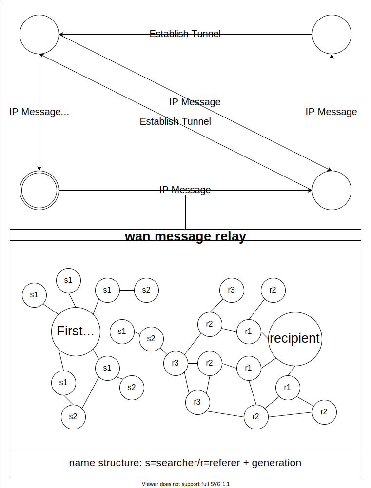
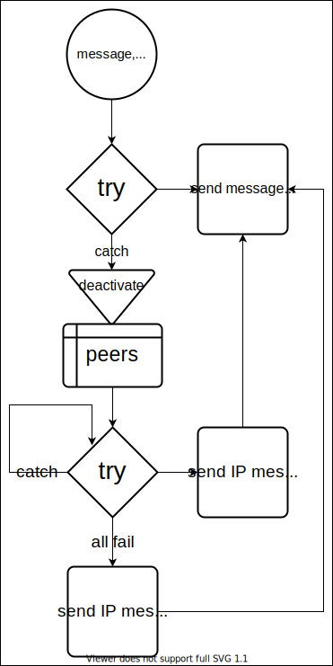
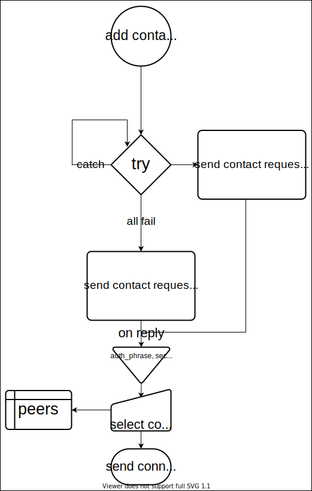

# Mesh

A P2P standard made for realtime communication based on the fact that your contacts likely share at least some of yours (In development)



Messages are to be sent via https (?AJAX) POST on port 7575 their data structure is as follows:
  * IP:
    ```
    header:
      {
        from: encrypted (?unique per contact) UUID of sender of request
        auth: authentication data
        type: "IP"
      }
    body:
      {
        to: UUID of the receipient
        from: encrypted (?unique per contact) UUID of sender
        secret: encrypted secret
        IP: encrypted IP of sender
        hops: distance to sender in hops
      }
    ```
  * referral (?better name):
    ```
    header:
      {
        from: encrypted (?unique per contact) UUID of sender of request
        auth: authentication data
        type: "referral"
      }
    body:
      {
        referent: UUID of the Peer refferred to
        hops: distance to referent in hops
      }
  * message:
    ```
    header:
      {
        from: encrypted (?unique per contact) UUID of sender of request
        auth: authentication data
        type: "message"
      }
    body:
      {
        body: encrypted message
      }
  * contact request:
    ```
    header:
      {
        from: encrypted (?unique per contact) UUID of sender of request
        auth: authentication data
        type: "contact_req"
      }
    request body:
      {
      	pub_key: public key of the sender
				from: UUID of sender
      	to: UUID of Peer of which the public key is requested
      }
    response body:
      {
      	pub_key: public key of Peer of which the public key is requested
      	auth_phrase: encrypted auth phrase
      	secret: encrypted secret
      } 
    ```
They are to be answered either with an error code when an error occurs or with status 200 and authentication.

Peers store:
  1. contacts: UUID, IP, public key (encrypt), secret
  2. refferals: UUID of the Peer refferred to, distance to referent in hops, UUIDs of the Peers to relay to, ?public key
  3. information about self: private key (decrypt), public key, UUID

Peers process incoming messages as follows:


Peers do the following when sending messages:



Peers add contacts as follows:



The direct authentication happens as follows:


